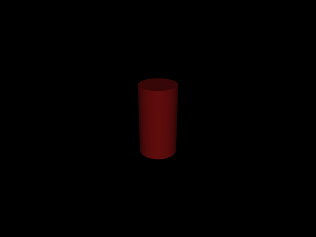
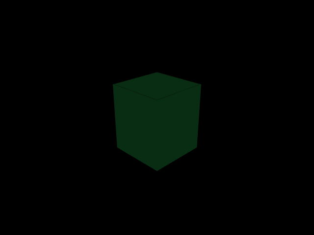

# prl_assets

Reusable manipulation objects for Personal Robotics Lab projects.

This package provides simulation models and metadata for common manipulation objects like cans, bins, and other graspable items. Objects follow the `asset_manager` metadata format for compatibility with perception and planning pipelines.

## Installation

```bash
uv add prl_assets
```

For development:
```bash
git clone https://github.com/personalrobotics/prl_assets.git
cd prl_assets
uv sync --dev
```

## Quick Start

Use with `asset_manager` to load objects:

```python
from asset_manager import AssetManager
from prl_assets import OBJECTS_DIR

# Initialize asset manager with prl_assets objects
assets = AssetManager(OBJECTS_DIR)

# List available objects
print(assets.list())
# ['can', 'recycle_bin']

# Get path to simulation model
can_path = assets.get_path("can", "mujoco")

# Load in MuJoCo
import mujoco
model = mujoco.MjModel.from_xml_path(can_path)

# Get object metadata
meta = assets.get("can")
print(meta["dimensions"])  # [0.066, 0.066, 0.123]
print(meta["mass"])        # 0.05 kg

# Find objects by category
recyclables = assets.by_category("recyclable")
```

## Available Objects

### can


Standard aluminum soda/beer can for manipulation tasks.

| Property | Value |
|----------|-------|
| Dimensions | 6.6cm diameter x 12.3cm height |
| Mass | 0.05 kg |
| Material | Aluminum |
| Categories | container, recyclable, graspable |

### recycle_bin


Open-top bin for discarding recyclable items.

| Property | Value |
|----------|-------|
| Dimensions | 25cm x 25cm x 30cm |
| Mass | 0.5 kg |
| Material | Plastic |
| Categories | container, receptacle, fixture |

## Object Structure

Each object follows a standardized directory structure:

```
objects/
└── object_name/
    ├── meta.yaml          # Object metadata
    ├── object_name.xml    # MuJoCo model
    ├── object_name.usd    # Isaac Sim model (optional)
    └── object_name.png    # Preview image
```

### Metadata Format

The `meta.yaml` file contains all object properties:

```yaml
name: can
description: Standard aluminum soda/beer can
category: [container, recyclable, graspable]

# Physical properties
mass: 0.05  # kg
dimensions: [0.066, 0.066, 0.123]  # meters
color: [0.8, 0.1, 0.1]  # RGB
material: aluminum

# Geometric properties for grasp planning
geometric_properties:
  type: cylinder
  radius: 0.033
  height: 0.123

# Simulator-specific configuration
mujoco:
  xml_path: can.xml
  scale: 1.0
  friction: [0.6, 0.005, 0.0001]

# Perception aliases for detection systems
perception:
  aliases: ["can", "soda can", "beer can"]

# Manipulation policy hints
policy:
  grasping:
    affordances: [lift, pour]
    preferred_grasp_type: side_grasp
    difficulty: easy
```

## Adding New Objects

1. Create a new directory under `src/prl_assets/objects/`
2. Add a `meta.yaml` with required fields
3. Add simulator model files (e.g., `.xml` for MuJoCo)
4. Run `uv run python scripts/render_objects.py` to generate preview image
5. Update this README with the new object

### MuJoCo Model Requirements

Objects used with `mj_environment` must follow these conventions:

```xml
<mujoco model="object_name">
  <worldbody>
    <body name="object_name" pos="0 0 0">
      <freejoint name="object_name_joint"/>  <!-- Required for positioning -->
      <!-- geoms, sites, etc. -->
    </body>
  </worldbody>
</mujoco>
```

- **freejoint**: Required for `registry.activate()` to set object position/orientation
- **body name**: Should match the object type (becomes `{type}_{index}` when loaded)

## License

MIT License - see LICENSE file for details.
